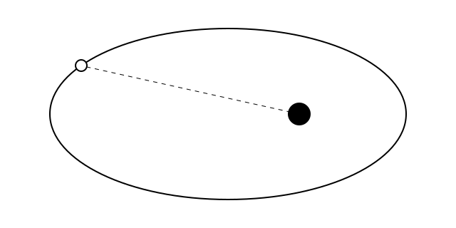

Copy this file to start a new post, rename it, and change the frontmatter
above. The filename becomes the post's address: `my-first-post.md` is served
at `/posts/my-first-post`.

`draft: true` keeps a post off the built site. `bun run dev` still shows it,
marked as a draft, so you can read it as you write. Set `draft: false` when it
is ready. A post whose `pubDate` is still in the future also stays off the
built site until that day.

Quote any value that contains a colon, as in `title: "Part 2: the sequel"`.

## Writing

Paragraphs are separated by a blank line. Use `##` for a heading, `*italics*`
and `**bold**` for emphasis, and `[a link](https://example.com)` for a link.

## Images

Put the image in `public/images/` and refer to it by its name alone. The alt
text in the brackets is shown as its caption.



## Maths

Inline maths goes between single dollar signs, as in $E = mc^2$, and display
maths between double ones:

$$
\frac{d^2 \mathbf{r}}{dt^2} = -\frac{G M}{r^3} \mathbf{r}
$$

## Code

```python
import numpy as np

print(np.linspace(0, 1, 5))
```

## Tables

| Object      | Discovered | Speed at infinity |
| ----------- | ---------- | ----------------- |
| 1I/ʻOumuamua | 2017       | 26 km/s           |
| 2I/Borisov  | 2019       | 32 km/s           |
